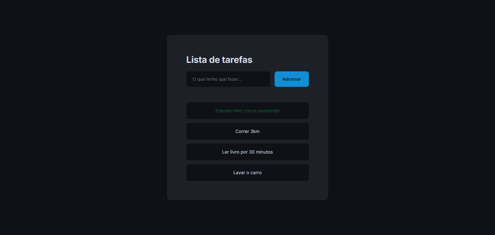

<h1>Lista de tarefas</h1>

Este projeto de Lista de Tarefas foi desenvolvido como parte de uma aula ministrada por mim para ensinar os conceitos essenciais de HTML, CSS e JavaScript. O projeto demonstra o uso de boas práticas de design, semântica adequada e estilização com CSS. Em JavaScript, são explorados o uso do DOM, condições, funções e o armazenamento de dados no navegador utilizando o LocalStorage. Esta é uma excelente introdução para aqueles que desejam entender o desenvolvimento front-end e criar aplicações web interativas e dinâmicas.

<h2>Imagem da aplicação</h2>

